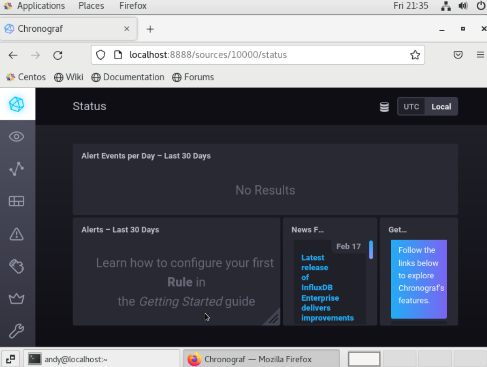
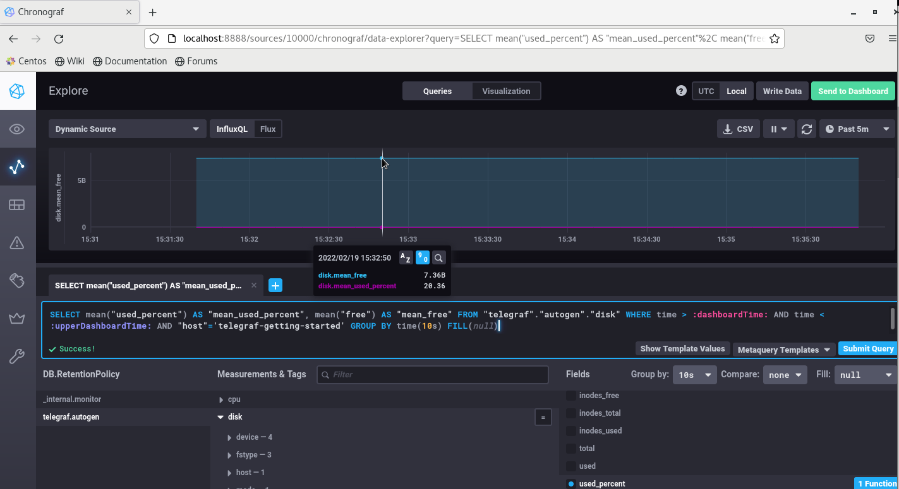
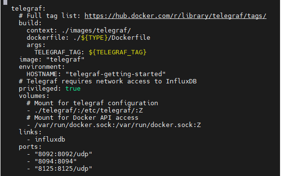
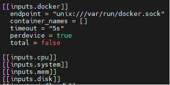

# Домашнее задание к занятию "10.02. Системы мониторинга"

## Обязательные задания

1. Опишите основные плюсы и минусы pull и push систем мониторинга.  
Push модель удобнее для клиентов, можно отправлять данные сразу в несколько систем реплик, проще потому что можно использовать UDP для отправки данных, в целом гибче.  
Pull модель в целом безопаснее и достовернее, проще отладка и удобнее настройка опроса клиентов из единой точки.


2. Какие из ниже перечисленных систем относятся к push модели, а какие к pull? А может есть гибридные?

    - Prometheus - в основном pull модель, но есть push gateway
    - TICK - работает по push модели
    - Zabbix - поддерживает и push и pull модель
    - VictoriaMetrics - поддерживает и push и pull модель
    - Nagios - push модель

3. Склонируйте себе [репозиторий](https://github.com/influxdata/sandbox/tree/master) и запустите TICK-стэк, 
используя технологии docker и docker-compose.

В виде решения на это упражнение приведите выводы команд с вашего компьютера (виртуальной машины):

    - curl http://localhost:8086/ping
```    
[andy@localhost sandbox]$ curl -v http://localhost:8086/ping
* About to connect() to localhost port 8086 (#0)
*   Trying ::1...
* Connected to localhost (::1) port 8086 (#0)
> GET /ping HTTP/1.1
> User-Agent: curl/7.29.0
> Host: localhost:8086
> Accept: */*
>
< HTTP/1.1 204 No Content
< Content-Type: application/json
< Request-Id: f278a23c-90e8-11ec-81df-0242ac120003
< X-Influxdb-Build: OSS
< X-Influxdb-Version: 1.8.10
< X-Request-Id: f278a23c-90e8-11ec-81df-0242ac120003
< Date: Fri, 18 Feb 2022 18:31:11 GMT
<
* Connection #0 to host localhost left intact
```
  
    - curl http://localhost:8888
```
    [andy@localhost sandbox]$ curl http://localhost:8888
<!DOCTYPE html><html><head><meta http-equiv="Content-type" content="text/html; charset=utf-8"><title>Chronograf</title><link rel="icon shortcut" href="/favicon.fa749080.ico"><link rel="stylesheet" href="/src.14d28054.css"></head><body> <div id="react-root" data-basepath=""></div> <script src="/src.bb2cd140.js"></script> </body></html>[andy@localhost sandbox]$ curl http://localhost:9092/kapacitor/v1/ping
```
    - curl http://localhost:9092/kapacitor/v1/ping

```    
[andy@localhost sandbox]$ curl -v http://localhost:9092/kapacitor/v1/ping
* About to connect() to localhost port 9092 (#0)
*   Trying ::1...
* Connected to localhost (::1) port 9092 (#0)
> GET /kapacitor/v1/ping HTTP/1.1
> User-Agent: curl/7.29.0
> Host: localhost:9092
> Accept: */*
>
< HTTP/1.1 204 No Content
< Content-Type: application/json; charset=utf-8
< Request-Id: e8d2c0e7-90e8-11ec-81ed-000000000000
< X-Kapacitor-Version: 1.6.3
< Date: Fri, 18 Feb 2022 18:30:55 GMT
<
* Connection #0 to host localhost left intact
```

А также скриншот веб-интерфейса ПО chronograf (`http://localhost:8888`). 


P.S.: если при запуске некоторые контейнеры будут падать с ошибкой - проставьте им режим `Z`, например
`./data:/var/lib:Z`

4. Перейдите в веб-интерфейс Chronograf (`http://localhost:8888`) и откройте вкладку `Data explorer`.

    - Нажмите на кнопку `Add a query`
    - Изучите вывод интерфейса и выберите БД `telegraf.autogen`
    - В `measurments` выберите mem->host->telegraf_container_id , а в `fields` выберите used_percent. 
    Внизу появится график утилизации оперативной памяти в контейнере telegraf.
    - Вверху вы можете увидеть запрос, аналогичный SQL-синтаксису. 
    Поэкспериментируйте с запросом, попробуйте изменить группировку и интервал наблюдений.

Для выполнения задания приведите скриншот с отображением метрик утилизации места на диске 
(disk->host->telegraf_container_id) из веб-интерфейса.


5. Изучите список [telegraf inputs](https://github.com/influxdata/telegraf/tree/master/plugins/inputs). 
Добавьте в конфигурацию telegraf следующий плагин - [docker](https://github.com/influxdata/telegraf/tree/master/plugins/inputs/docker):
```
[[inputs.docker]]
  endpoint = "unix:///var/run/docker.sock"
```

Дополнительно вам может потребоваться донастройка контейнера telegraf в `docker-compose.yml` дополнительного volume и 
режима privileged:
```
  telegraf:
    image: telegraf:1.4.0
    privileged: true
    volumes:
      - ./etc/telegraf.conf:/etc/telegraf/telegraf.conf:Z
      - /var/run/docker.sock:/var/run/docker.sock:Z
    links:
      - influxdb
    ports:
      - "8092:8092/udp"
      - "8094:8094"
      - "8125:8125/udp"
```

После настройке перезапустите telegraf, обновите веб интерфейс и приведите скриншотом список `measurments` в 
веб-интерфейсе базы telegraf.autogen . Там должны появиться метрики, связанные с docker.

Метрики не появились, хотя настройки провел согласно рекомендациям:



Факультативно можете изучить какие метрики собирает telegraf после выполнения данного задания.

## Дополнительное задание (со звездочкой*) - необязательно к выполнению

В веб-интерфейсе откройте вкладку `Dashboards`. Попробуйте создать свой dashboard с отображением:

    - утилизации ЦПУ
    - количества использованного RAM
    - утилизации пространства на дисках
    - количество поднятых контейнеров
    - аптайм
    - ...
    - фантазируйте)
    
    ---

### Как оформить ДЗ?

Выполненное домашнее задание пришлите ссылкой на .md-файл в вашем репозитории.

---

