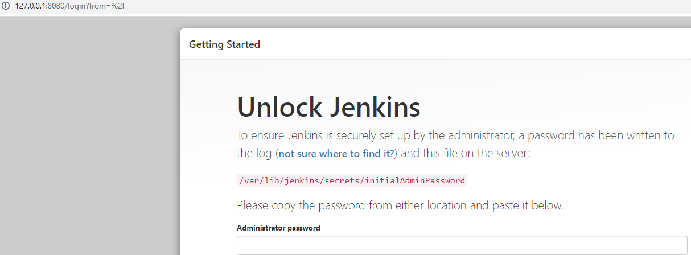
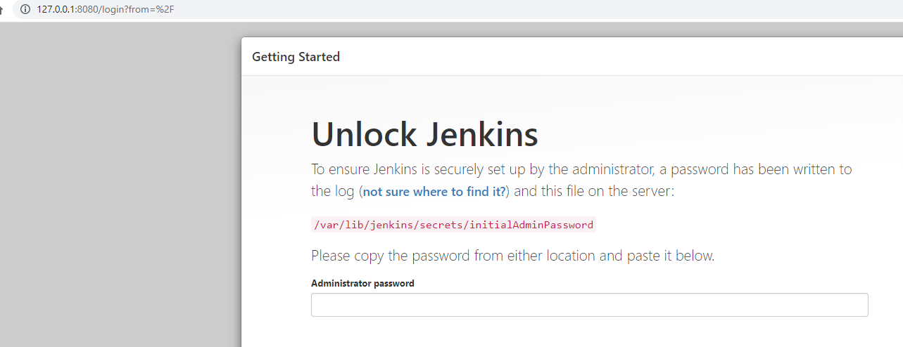

# Домашнее задание к занятию "5.4. Практические навыки работы с Docker"

## Задача 1 

В данном задании вы научитесь изменять существующие Dockerfile, адаптируя их под нужный инфраструктурный стек.

Измените базовый образ предложенного Dockerfile на Arch Linux c сохранением его функциональности.

```text
FROM ubuntu:latest

RUN apt-get update && \
    apt-get install -y software-properties-common && \
    add-apt-repository ppa:vincent-c/ponysay && \
    apt-get update
 
RUN apt-get install -y ponysay

ENTRYPOINT ["/usr/bin/ponysay"]
CMD ["Hey, netology”]
```


Для получения зачета, вам необходимо предоставить:
- Написанный вами Dockerfile
```text
FROM archlinux:latest

RUN pacman -Syu --noconfirm
RUN pacman -Sy --noconfirm ponysay
   
ENTRYPOINT ["/usr/bin/ponysay"]
CMD ["Hey, netology”]
```
- Скриншот вывода командной строки после запуска контейнера из вашего базового образа

- Ссылку на образ в вашем хранилище docker-hub  
https://hub.docker.com/repository/docker/andyoleinikov/ponyash

## Задача 2 

В данной задаче вы составите несколько разных Dockerfile для проекта Jenkins, опубликуем образ в `dockerhub.io` и посмотрим логи этих контейнеров.

- Составьте 2 Dockerfile:

    - Общие моменты:
        - Образ должен запускать [Jenkins server](https://www.jenkins.io/download/)
        
    - Спецификация первого образа:
        - Базовый образ - [amazoncorreto](https://hub.docker.com/_/amazoncorretto)
        - Присвоить образу тэг `ver1` 
    
    - Спецификация второго образа:
        - Базовый образ - [ubuntu:latest](https://hub.docker.com/_/ubuntu)
        - Присвоить образу тэг `ver2` 

- Соберите 2 образа по полученным Dockerfile
- Запустите и проверьте их работоспособность
- Опубликуйте образы в своём dockerhub.io хранилище

Для получения зачета, вам необходимо предоставить:
- Наполнения 2х Dockerfile из задания

```text
FROM amazoncorretto:latest

RUN amazon-linux-extras install epel -y \
    && yum update -y \
    && yum install -y wget \
    && yum install -y epel-release \
    && wget -O /etc/yum.repos.d/jenkins.repo \
    https://pkg.jenkins.io/redhat-stable/jenkins.repo \
    && rpm --import https://pkg.jenkins.io/redhat-stable/jenkins.io.key \
    && yum upgrade \
    && yum install -y jenkins 

RUN yum install -y initscripts 

EXPOSE 8080

CMD service jenkins start && bash
```

```text
FROM ubuntu:latest

RUN apt-get update -y  \
    && apt-get install -y wget \
    && apt-get install -y gnupg2  \
    && wget -q -O - https://pkg.jenkins.io/debian/jenkins.io.key | apt-key add - \
    && sh -c 'echo deb http://pkg.jenkins.io/debian-stable binary/ > /etc/apt/sources.list.d/jenkins.list' \
    && apt update \
    && apt install default-jdk -y \
    && apt install jenkins -y

EXPOSE 8080

CMD service jenkins start && bash
```

- Скриншоты логов запущенных вами контейнеров (из командной строки)  


- Скриншоты веб-интерфейса Jenkins запущенных вами контейнеров (достаточно 1 скриншота на контейнер)


- Ссылки на образы в вашем хранилище docker-hub  
https://hub.docker.com/repository/docker/andyoleinikov/coretto-jenkins  
https://hub.docker.com/repository/docker/andyoleinikov/ubuntu-jenkins

## Задача 3 

В данном задании вы научитесь:
- объединять контейнеры в единую сеть
- исполнять команды "изнутри" контейнера

Для выполнения задания вам нужно:
- Написать Dockerfile: 
    - Использовать образ https://hub.docker.com/_/node как базовый
    - Установить необходимые зависимые библиотеки для запуска npm приложения https://github.com/simplicitesoftware/nodejs-demo
    - Выставить у приложения (и контейнера) порт 3000 для прослушки входящих запросов  
    - Соберите образ и запустите контейнер в фоновом режиме с публикацией порта

- Запустить второй контейнер из образа ubuntu:latest 
- Создайть `docker network` и добавьте в нее оба запущенных контейнера
- Используя `docker exec` запустить командную строку контейнера `ubuntu` в интерактивном режиме
- Используя утилиту `curl` вызвать путь `/` контейнера с npm приложением  

```bash
task3>docker build . -t node-simple  
task3>docker run -it -p 3000:3000 --env VCAP_APP_HOST=0.0.0.0 --network=my-network node-simple

> nodejs-demo@1.1.16 start
> node app.js

Server listening on 0.0.0.0:3000
```

Для получения зачета, вам необходимо предоставить:
- Наполнение Dockerfile с npm приложением
```text
FROM node:latest

WORKDIR /usr/app
COPY ./nodejs-demo /usr/app
RUN npm install

CMD [ "npm","start" ]
```

- Скриншот вывода вызова команды списка docker сетей (docker network cli)

- Скриншот вызова утилиты curl с успешным ответом

---

### Как cдавать задание

Выполненное домашнее задание пришлите ссылкой на .md-файл в вашем репозитории.

---
